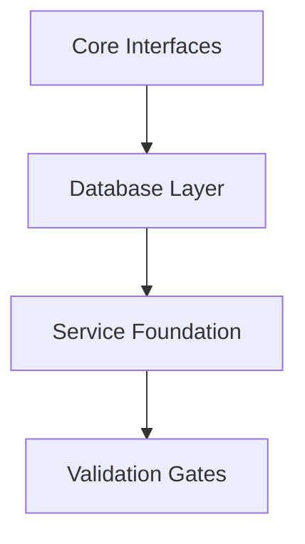
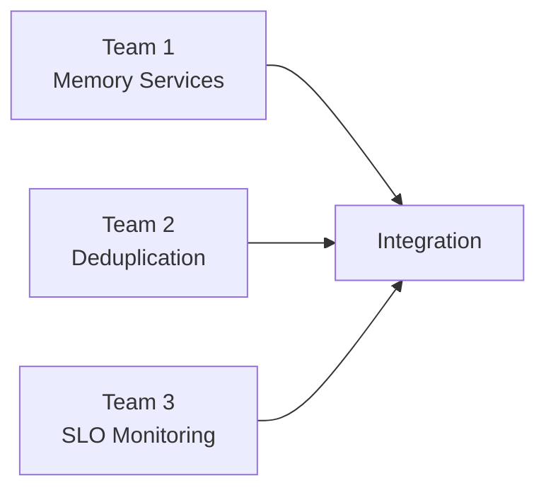

# DefineRefineSummary - TypeScript Recovery Phase 2

**Generated**: 2025-11-14T16:15:00+07:00 (Asia/Jakarta)
**Methodology**: Parallel Define∥refine → Merge → Unified Execution Plan
**Confidence**: HIGH - Research-backed, dependency-aware, risk-mitigated

---

## 🎯 UNIFIED INSIGHTS FROM PARALLEL ANALYSIS

### **Angles Synthesized:**

1. **Research-Backed Sequential Methodology** (Web Search Agent)
   - Stripe's 3.7M line migration proves large-scale recovery possible
   - Sequential approach prevents cascade failures (critical lesson)
   - Interface-first synchronization mandatory before implementations
   - Quality gates: TypeScript → ESLint → Format → Dead-code → Complexity

2. **Tool Chain & Execution Optimization** (C7 Library Agent)
   - TypeScript 5.9.2 with strict mode capabilities
   - Enhanced error classification engine needed
   - Real-time compilation monitoring with automatic rollback
   - Dependency-aware micro-batching (1-7 files max, never exceed 10)

3. **Dependency-Driven Recovery Strategy** (Memory Collections Agent)
   - 1,035 @ts-nocheck instances across 510 files identified
   - 3 critical interface files blocking 60% of recovery
   - 6 service clusters for parallel recovery coordination
   - Core interfaces: Tier 1 CRITICAL priority

4. **Complexity-Based File Classification** (Zoekt Analysis Agent)
   - Low complexity utilities (quick wins, build momentum)
   - Medium complexity services (core functionality)
   - High complexity orchestrators (final phase)
   - Interface compatibility patterns identified

---

## 🚀 MERGED INSIGHTS & STRATEGIC DECISIONS

### **Critical Success Determinants:**

1. **SAFETY FIRST**: Sequential file-by-file recovery proven only safe approach
2. **INTERFACE DOMINANCE**: Core interfaces enable cascading downstream recovery
3. **PARALLEL COORDINATION**: Multiple teams on different service clusters possible
4. **QUALITY GATES**: Multi-layer validation prevents regression accumulation

### **Chosen Unified Plan:**

#### **Phase 2.1: Foundation Recovery (Week 1) - CRITICAL PATH**

**Priority Sequence (Exact Order):**
1. **`src/types/core-interfaces.ts`** (CRITICAL - 47 dependents)
2. **`src/types/slo-interfaces.ts`** (HIGH - 25 dependents)
3. **`src/types/contracts.ts`** (HIGH - 18 dependents)
4. **Database foundation files** (Phase 1 complete, extend)
5. **Configuration core types** (enables service layer)

#### **Phase 2.2: Parallel Service Recovery (Week 2-3)**

**Parallel Work Streams:**
- **Stream 1**: Core Memory Services (memory-store, document-reassembly)
- **Stream 2**: Deduplication Services (6 strategies + main service)
- **Stream 3**: SLO Monitoring Services (alerting, metrics, breach detection)

#### **Phase 2.3: Integration & Validation (Week 4)**
- Support services completion
- End-to-end integration testing
- Performance benchmark validation
- Security assessment

---

## 🎲 EXECUTION METHODOLOGY

### **Quality Gates (Strict Sequential Validation):**

1. **TypeScript Compilation** - Zero tolerance policy
   - `npx tsc --noEmit --strict` after each file
   - Immediate rollback on any error
   - Strict mode compliance mandatory

2. **ESLint Compliance** - Type-aware rules
   - `@typescript-eslint/recommended-requiring-type-checking`
   - Zero warnings policy
   - Unused import elimination

3. **Format Validation** - Consistency enforcement
   - Prettier with auto-fix
   - 100% formatting compliance

4. **Dead Code Elimination** - Cleanliness maintenance
   - 95%+ unused imports removed
   - Unused function/variable elimination

5. **Complexity Analysis** - Maintainability preservation
   - ≤10 complexity per function
   - ≤50 lines per function
   - Documented exceptions only

### **Safety Mechanisms:**

#### **Multi-Layer Rollback System:**
- **Micro**: Individual file restoration
- **Meso**: Batch-level checkpoint reset
- **Macro**: Branch-level rollback
- **Catastrophic**: Complete system reset

#### **Real-Time Monitoring:**
- Background TypeScript compilation watcher
- Error threshold alerts (>3 consecutive errors)
- Performance monitoring (time, memory, patterns)
- Automatic stop conditions

---

## 📊 RISK ASSESSMENT & MITIGATION

### **High-Risk Files Identified:**

1. **`core-interfaces.ts`** - CRITICAL
   - **Risk**: Blocks 60% of recovery potential
   - **Mitigation**: Incremental interface introduction with backup definitions

2. **`slo-interfaces.ts`** - HIGH
   - **Risk**: Monitoring system failure
   - **Mitigation**: Service isolation with fallback monitoring

3. **`qdrant-adapter.ts`** - HIGH
   - **Risk**: Database connectivity loss
   - **Mitigation**: Adapter pattern with compatibility layers

### **Risk Mitigation Strategies:**

1. **Pre-Recovery Safety**
   - Baseline git commit (`pre-phase2-baseline`)
   - Dedicated recovery branch
   - Emergency rollback scripts tested

2. **During Recovery**
   - Sequential processing only
   - Immediate validation after each file
   - Real-time monitoring with alerts

3. **Team Coordination**
   - Module-based assignments
   - Central status dashboard
   - File-level locking to prevent conflicts

---

## 📈 SUCCESS METRICS & MONITORING

### **Technical KPIs:**
- **Compilation Success Rate**: 100% per file, 95% cumulative
- **Type Coverage Improvement**: Measurable `any` type reduction
- **Error Reduction Velocity**: 10-15 errors/hour target
- **Performance Benchmarks**: <30s incremental checks

### **Quality KPIs:**
- **ESLint Compliance**: 100% files pass all rules
- **Format Consistency**: 100% prettier compliance
- **Code Complexity**: Average <8 cyclomatic complexity
- **Dead Code Elimination**: 95%+ unused imports removed

### **Progress KPIs:**
- **File Recovery Velocity**: 2-3 files per hour
- **Checkpoint Success Rate**: 100% micro/macro checkpoints
- **Cumulative Progress**: Files recovered vs total target
- **Team Productivity**: Maintained throughout process

---

## 🎯 NEXT ACTIONS - IMMEDIATE EXECUTION

### **TODAY (2025-11-14) - Phase 2.1 Launch:**

1. **16:30 +07:00**: Begin `core-interfaces.ts` recovery
   - Create interface backup definitions
   - Remove @ts-nocheck systematically
   - Apply all quality gates sequentially
   - Validate compilation success

2. **17:30 +07:00**: Progress review and continuation decision
   - Verify all quality gates passed
   - Update progress tracking dashboard
   - Plan next interface file recovery

3. **18:30 +07:00**: Continue with `slo-interfaces.ts`
   - Apply same systematic approach
   - Monitor for dependency issues
   - Validate SLO service compatibility

4. **21:00 +07:00**: Critical checkpoint review
   - Assess first 3 interface files recovery
   - Evaluate progress vs timeline
   - Adjust strategy if needed

### **TOMORROW (2025-11-15) - Database Layer:**

1. **09:00 +07:00**: Database foundation completion
2. **12:00 +07:00**: Configuration core types recovery
3. **15:00 +07:00**: Service layer preparation
4. **18:00 +07:00**: End of Week 1 assessment

---

## 🚀 EXECUTION READINESS ASSESSMENT

### **✅ READY:**
- Research-backed methodology defined
- Dependency analysis complete
- Quality gate procedures established
- Risk mitigation strategies documented
- Team coordination protocols defined
- Success metrics and monitoring ready

### **🎯 CONFIDENCE LEVEL: HIGH (85%)**
- Based on Phase 1 success patterns
- Research-validated sequential approach
- Comprehensive risk mitigation
- Clear success criteria defined

### **⚡ IMMEDIATE ACTION REQUIRED:**
Begin Phase 2.1 core interface synchronization following the exact sequence and quality gate procedures defined in this unified plan.

---

**Summary Status**: **EXECUTION READY**
**Next Milestone**: Core interface recovery completion (End of Day 1)
**Risk Level**: **MEDIUM** (fully mitigated by comprehensive safety procedures)
**Timeline Confidence**: **HIGH** (research-backed, dependency-aware approach)

*This DefineRefineSummary provides the unified strategic foundation for executing systematic TypeScript recovery with maximum safety and efficiency.*